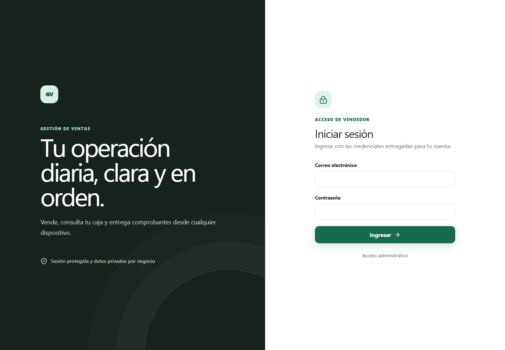
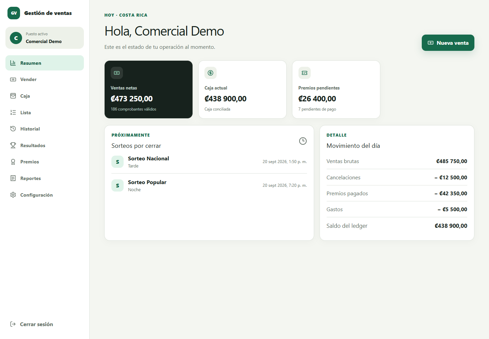

# Multi-tenant Sales SaaS

Aplicación web full-stack para administrar ventas, caja, resultados, premios y reportes de negocios independientes mediante una arquitectura multi-tenant.

> Edición demostrativa para portafolio. Utiliza exclusivamente datos ficticios, no custodia ni transfiere dinero y no está afiliada con ninguna institución oficial.

## Vista del producto

| Acceso de vendedor | Resumen operativo |
| --- | --- |
|  |  |

Las capturas se generan mediante una prueba visual reproducible. El dashboard intercepta todas las solicitudes y utiliza exclusivamente una sesión, importes y sorteos ficticios.

## Problema que resuelve

La aplicación reemplaza registros manuales y cálculos dispersos por un flujo trazable:

```text
configuración -> venta -> comprobante -> resultado -> premio -> pago -> conciliación
```

Cada negocio opera como un `tenant` aislado. El administrador del SaaS gestiona suscripciones y acceso, pero no puede operar ventas, caja ni resultados de los clientes.

## Capacidades principales

- Autenticación separada para vendedor y administrador SaaS.
- Sesiones persistentes con access token corto y refresh token rotatorio.
- Aislamiento de datos por `tenant` derivado de la sesión autenticada.
- Configuración versionada de catálogos, horarios, límites y multiplicadores.
- Registro de ventas con idempotencia y control de concurrencia.
- Caja contable, movimientos y conciliación diaria.
- Resultados, reevaluación de premios y registro de pagos.
- Reportes y comprobantes PDF/CSV generados bajo demanda.
- Jobs centrales con locks compartidos en MySQL.
- Interfaz responsive y PWA sin mutaciones financieras offline.

## Arquitectura

```text
React PWA
   -> REST JSON / cookies HttpOnly
Express 5
   -> route
   -> middlewares + Joi
   -> controller
   -> service
   -> adaptador SQL
   -> MySQL 8
```

El proyecto usa módulos por dominio e inyección manual de dependencias. Los controllers no acceden a MySQL y los services no dependen de Express ni del pool.

Dominios principales:

- `auth`
- `saas-admin`
- `tenant-settings`
- `cash`
- `sales`
- `results`
- `reports`
- `jobs`
- `system`

## Decisiones técnicas destacadas

### Idempotencia

Las mutaciones sensibles reciben un `requestId` asociado con el actor y el payload. Un timeout o resultado incierto reutiliza el mismo identificador para impedir ventas o movimientos duplicados.

### Consistencia y concurrencia

Las escrituras críticas usan una sola conexión, transacciones explícitas, `SELECT ... FOR UPDATE`, orden estable de locks, constraints únicos y máquinas de estado.

### Multi-tenancy

El cliente no decide su `tenantId`. La API lo obtiene de la sesión y la membership vigentes; las consultas operativas incluyen o derivan ese contexto de manera inequívoca.

### Dinero

MySQL conserva los importes como `DECIMAL` y JavaScript los trata como strings o enteros escalados. El frontend no es la fuente autoritativa de cálculos financieros.

### PWA segura

La PWA precachea solamente el shell y assets versionados. No almacena respuestas autenticadas, no usa Background Sync y no encola mutaciones sensibles para ejecutarlas después.

## Retos, decisiones y compensaciones

| Reto | Decisión aplicada | Compensación asumida |
| --- | --- | --- |
| Evitar que un negocio acceda a información de otro | Derivar el `tenantId` de la sesión autenticada y aplicarlo en autorización y consultas SQL | Un esquema compartido reduce costo operativo, pero exige revisar cada nuevo acceso a datos; una base por tenant no se justificaba para el alcance actual |
| Impedir ventas o movimientos duplicados ante reintentos | Combinar claves idempotentes, restricciones únicas y transacciones InnoDB | El contrato debe conservar el mismo identificador durante todo el reintento y añade estados de recuperación |
| Mantener caja, ticket y exposición consistentes bajo concurrencia | Bloquear filas críticas dentro de una transacción y conservar un orden estable de locks | Las secciones críticas pueden serializar operaciones sobre los mismos recursos, a cambio de impedir saldos parciales |
| Ejecutar sorteos y procesos programados sin duplicarlos | Diseñar jobs idempotentes y coordinarlos mediante locks persistidos en MySQL | Evita introducir una cola adicional en esta etapa, aunque MySQL también asume la coordinación de jobs |
| Preservar la explicación histórica de una venta | Versionar configuración y guardar snapshots de los valores que afectan cálculos | Consume más almacenamiento y requiere modelos explícitos, pero una regla futura no reescribe el pasado |
| Ofrecer una PWA sin comprometer operaciones sensibles | Cachear solamente el shell y recursos públicos; mantener las mutaciones financieras en línea | La aplicación no permite vender offline, priorizando consistencia y confirmación del servidor |

### Aprendizajes principales

- El multi-tenancy no es solamente una columna: afecta identidad, autorización, consultas, jobs, límites y pruebas.
- La idempotencia necesita respaldo en la base de datos; una comprobación previa en memoria no cubre solicitudes concurrentes.
- Los flujos de dinero deben probar también rollback, duplicados y concurrencia, no únicamente el camino exitoso.
- Una arquitectura modular resulta útil cuando permite cambiar una regla sin duplicarla entre HTTP, jobs y persistencia.
- Agregar infraestructura antes de necesitarla puede aumentar el costo operativo; para este alcance, MySQL cubre datos, locks e idempotencia de forma suficiente.

## Stack

Backend:

- JavaScript ESM, Node.js 22 y Express 5.
- MySQL 8 mediante `mysql2/promise`.
- Joi, JWT, bcrypt, Winston y PDFKit.
- Jest y Supertest.

Frontend:

- React 19, Vite 8 y React Router.
- TanStack Query, React Hook Form y Zod.
- Tailwind CSS.
- Vitest, Testing Library, Playwright y axe.

## Estructura

```text
src/modules/              rutas, controllers y services
src/container/            composición de dependencias
src/schemas/              validación Joi
src/shared/database/      SQL, transacciones y locks
src/shared/middleware/    autenticación y autorización
database/migrations/      migraciones inmutables
frontend/src/features/    interfaz organizada por dominio
frontend/src/shared/      API client, sesión y componentes comunes
```

## Ejecución local

Requisitos:

- Node.js `22.15.1` o compatible con el rango declarado.
- MySQL 8.

Backend:

```bash
npm ci
cp .env.example .env
npm run db:migrate
npm run dev
```

Frontend, en otra terminal:

```bash
cd frontend
npm ci
cp .env.example .env.local
npm run dev
```

Antes de ejecutar migraciones se debe revisar el destino configurado. El proyecto exige guardas explícitas para operaciones de base de datos y pruebas de integración.

## Calidad

```bash
npm run check
npm run db:validate
npm --prefix frontend run check
```

Las pruebas de integración requieren una base MySQL exclusiva de pruebas y las variables de autorización documentadas en los scripts correspondientes.

## Alcance de esta edición

Esta versión pública excluye deliberadamente:

- credenciales y datos reales;
- configuración de staging o producción;
- runbooks operativos y backups;
- identificadores de proveedores cloud;
- documentación interna de planificación;
- historial Git del producto operativo.

La publicación demuestra decisiones de arquitectura y calidad de código; no representa autorización para operar un negocio regulado ni sustituye una revisión legal, de privacidad o de seguridad.

## Estado

Copia pública saneada y verificada localmente. Se mantiene separada del repositorio operativo y está preparada para una última revisión humana antes de publicarse.

## Licencia

Este proyecto se distribuye bajo la licencia MIT. Consulta [LICENSE](LICENSE) para conocer sus términos.
